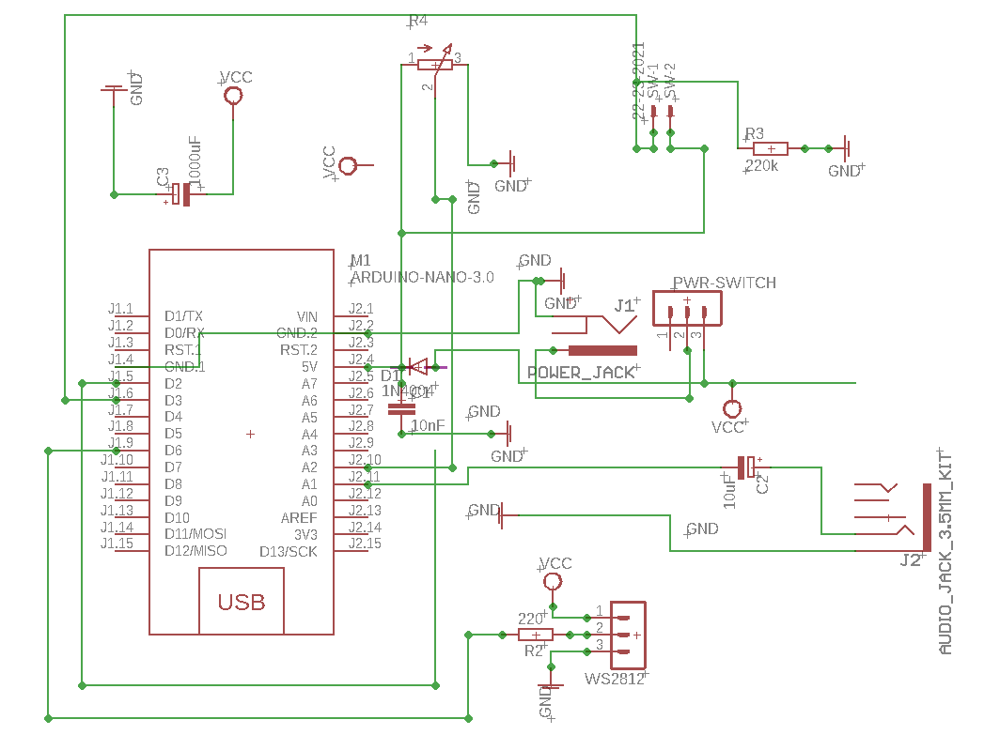

# RGBStripe_Control_WS2812

# RGB Backlight
* WS2812B RGB LED Stripe + Arduino Nano
* Switching modes via Button
* Tweaking mode settings via Potentiometer

## Audio Visualizer with MSGEQ7 Hardware
[RGBStripe_MSGEQ7](/RGBStripe_FFT)

* MSGEQ7 Circuit connected to Arduino
* Audio Spectrum Analyzer using MSGEQ7 Band outputs

## Audio Visualizer with Fast Fourier Transformation (FFT)
### Work in Progress...
### Schematic

### 3D Printed Case

[RGBStripe_FFT](/RGBStripe_FFT)

* 3.5mm Aux connected to Analog Input of Arduino
* Audio Spectrum Analyzer using in Software FFT Algorithm to divide Signal in Audio Bands

## See Instructables for details:  [Instructable](https://www.instructables.com/id/RGB-Backlight-MSGEQ7-Audio-Visualizer/)

